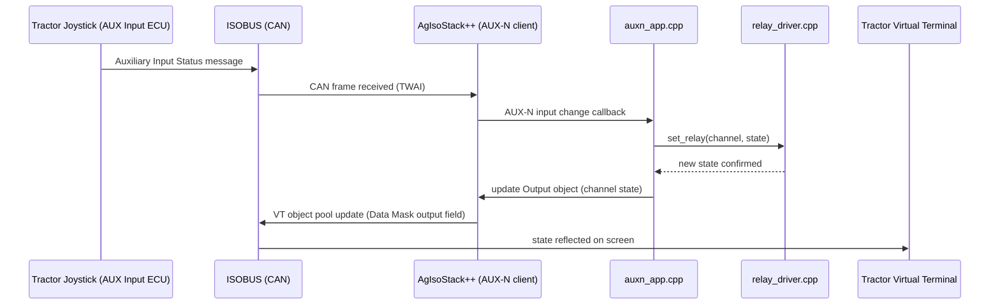

# Firmware Architecture (Proposal)

Status: proposal, not yet implemented. Written to guide Phase 1+ of the
[roadmap](roadmap.md); expect this to evolve once real hardware
bring-up starts.

## High-level decisions

| Decision | Choice | Rationale |
|---|---|---|
| Framework | **ESP-IDF** (native), not Arduino | AgIsoStack++ is C++17, threads-based, and already ships a CMake ESP32 TWAI driver; ESP-IDF gives full control over FreeRTOS tasks, NVS, and the TWAI/W5500 drivers without an Arduino compatibility shim in the way. |
| ISOBUS/J1939 stack | **AgIsoStack++** | Open source (MIT), actively maintained, already implements address claiming, VT client, and AUX-N — exactly the pieces this project needs. Avoids re-implementing ISO 11783 by hand. |
| CAN driver | AgIsoStack++'s built-in `TWAI` `CANHardwarePlugin` | Matches this board's CAN path (ESP32-S3 TWAI controller, TX=`GPIO17`/RX=`GPIO18` → onboard isolated transceiver). Confirmed via [hardware.md](hardware.md#gpio-mapping). |
| Language | C++17 | Required by AgIsoStack++; fine for ESP-IDF. |
| Config storage | ESP-IDF **NVS** | Built-in, wear-leveled key/value flash storage; sufficient for channel names/icons/AUX-N mappings/automation rules. |
| Ethernet (W5500) | Optional, non-ISOBUS | Only used for local web config UI, log export, and OTA — never for ISOBUS traffic. |
| WiFi | Always-on SoftAP, `AgIsoBlock-XXXX` SSID | Guarantees an OTA/config path even with no Ethernet cable connected; never used for ISOBUS traffic. |
| OTA mechanism | ESP-IDF `esp_https_ota` + dual OTA partitions | Standard ESP-IDF pattern: rollback-safe (new image must self-validate or the bootloader reverts to the previous slot). |

## Why not build on the Waveshare Arduino demo?

The vendor demo (WiFi AP/STA/MQTT relay control + CAN print) is useful only
to confirm GPIO mapping and prove out low-level driver behavior. Its
application logic (WiFi/Bluetooth relay toggling, Waveshare Cloud) is
unrelated to what we're building and Waveshare Cloud is stated as
"no longer maintained" — none of that is reused. We treat it purely as a
reference for bring-up, then build the real application against ESP-IDF +
AgIsoStack++ directly.

## Module layout (planned)

```
firmware/
├── main/
│   ├── app_main.cpp            — startup, task creation
│   ├── io/
│   │   ├── relay_driver.[hc]pp — TCA9554PWR I²C IO-expander abstraction (8ch, addr 0x20, shares I2C bus with RTC)
│   │   ├── input_driver.[hc]pp — GPIO digital input abstraction (8ch: GPIO4-11, debounced)
│   │   ├── buzzer_driver.[hc]pp — buzzer (GPIO46) momentary pulse, driven by VT/AUX-N "buzzer" function
│   │   └── status_led.[hc]pp   — WS2812 (GPIO38) status indication only (power/CAN/VT state)
│   ├── isobus/
│   │   ├── ecu_identity.cpp    — NAME construction, address claim setup
│   │   ├── vt_app.[hc]pp       — object pool per vt-ui-design.md (Data Mask + Main SKM + 17 Auxiliary
│   │   │                        Functions), VT client glue, and AUX-N input handling -- merged into one
│   │   │                        module rather than the auxn_app.[hc]pp split originally planned here,
│   │   │                        since both sides share the same VirtualTerminalClient event dispatcher
│   │   └── diagnostics.cpp     — DM1 reporting (stretch goal)
│   ├── automation/
│   │   ├── interlock.[hc]pp    — first (hardcoded) rule: DI{n} limit-switches channel {n} off
│   │   └── rules_engine.[hc]pp — general input-to-output rule evaluation (not yet started;
│   │                             interlock.cpp above is deliberately a fixed special case,
│   │                             not built on top of a general schema, until one is needed)
│   ├── config/
│   │   └── nvs_store.[hc]pp    — channel names/icons/AUX-N map/rules persistence
│   └── net/
│       ├── wifi_ap.[hc]pp      — always-on SoftAP (AgIsoBlock-XXXX), STA join (optional)
│       ├── ota_service.[hc]pp  — HTTPS/HTTP OTA update endpoint, image validation
│       └── web_ui.[hc]pp       — (optional) local config/diagnostics web UI over WiFi AP/Ethernet
├── components/                 — vendored/pinned AgIsoStack++ (as ESP-IDF component)
└── CMakeLists.txt
```

This is a proposal, not a commitment — it will be adjusted once GPIO
mapping and AgIsoStack++'s ESP32 integration are validated on the bench.

## Runtime task layout (planned)

- **CAN RX/TX task(s):** owned by AgIsoStack++'s `CANHardwareInterface`
  (library-managed thread(s) via ESP-IDF pthread).
- **Stack periodic task:** drives address claiming, VT client state
  machine, AUX-N message handling (library-managed).
- **I/O task:** polls/debounces 8 digital inputs (direct GPIO), drives 8
  relay channels over I²C via the TCA9554PWR expander (shared bus with the
  RTC — needs a mutex/serialized access, see [hardware.md](hardware.md#gpio-mapping)),
  runs the automation rules engine, pushes state changes into the VT
  object pool / AUX-N function status.
- **Config task:** handles NVS reads/writes, triggered by VT input events
  (renaming a channel, changing an icon, editing an automation rule) —
  kept low-frequency/off the hot path.
- **Net task:** always-on WiFi SoftAP + lightweight HTTP(S) server for
  OTA/config, plus optional W5500 Ethernet and/or WiFi station join if the
  user configures one. Fully decoupled from the ISOBUS path so a network
  issue (or an OTA in progress) can never stall relay/VT behavior — CAN
  and network run as independent tasks, not a shared blocking loop.

## Data flow (example: pressing a mapped joystick button)



## Configuration & persistence model (planned)

Stored in NVS, one namespace per concern:

- `channels`: per-channel `{name, icon_id, aux_function_enabled}`
- `auxn`: assignment bookkeeping as required by the AUX-N preferred
  assignment mechanism (mostly VT/terminal-managed, but persisted locally
  so behavior survives reboot without re-teaching)
- `rules`: automation rules as `{input_channel, trigger (rising/falling/level), output_channel, action (toggle/on/off/pulse)}`
- `system`: device instance number, last-known working NAME bits, and any
  user-visible identification fields shown on the VT.
- `network`: SoftAP password (generated at first boot, re-shown via
  VT/label, not hardcoded), optional WiFi station credentials, optional
  static/DHCP Ethernet preference.

Editing of `channels` and `rules` happens **entirely from the VT** (Input
String for names, Input Boolean/Numeric Value + Object Pointer for icon
and rule pickers) so no laptop or companion app is required in the field —
this mirrors ISOBUS Block's "no code, no app, no laptop" pitch. The
local web UI (over WiFi AP or Ethernet) is a secondary convenience for
bench setup and OTA only.

## WiFi AP & OTA (planned)

- The device brings up a **SoftAP on every boot**, independent of whether
  Ethernet is connected or WiFi station mode is also configured. This
  guarantees there's always a way to reach the device for OTA/config,
  even freshly unboxed or mounted somewhere without a network drop.
- **SSID:** `AgIsoBlock-XXXX`, where `XXXX` is 4 uppercase hex characters
  taken from the last 2 bytes of the ESP32-S3's WiFi station MAC address
  (`esp_wifi_get_mac(WIFI_IF_STA, ...)` at boot, formatted `%02X%02X`).
  Deterministic per unit, unique enough for a home/farm network, and
  needs no label lookup beyond the MAC already printed on the module.
- **AP password (implemented 2026-09-11):** a random 12-character
  password, generated once at first boot and persisted to NVS from then
  on — never a fixed/shared default, per requirement N7. See
  [net/wifi_ap.cpp](../firmware/main/net/wifi_ap.cpp). Currently
  retrievable only via the serial log at boot; a VT-side display (and a
  way to change it from there) is the natural next step, tracked in
  [roadmap.md](roadmap.md#phase-7--wifi-ap--ota).
- **OTA delivery (implemented 2026-09-11):** direct `esp_ota_ops` against
  the dual OTA partition scheme (`ota_0`/`ota_1` + `otadata`,
  [partitions.csv](../firmware/partitions.csv)) — **not**
  `esp_https_ota` as originally planned here: that API is an HTTPS
  *client* that pulls an image from a remote URL, which doesn't fit
  "upload a file from the browser" at all. The local web UI's
  `POST /ota/upload` streams the request body directly into
  `esp_ota_begin`/`esp_ota_write`/`esp_ota_end`, so a failed/incompatible
  image can be rolled back automatically by the bootloader
  (`esp_ota_mark_app_valid_cancel_rollback` after the new image proves
  itself by successfully claiming its ISOBUS address, or a proactive
  `esp_ota_mark_app_invalid_rollback_and_reboot` if it doesn't). See
  [net/web_server.cpp](../firmware/main/net/web_server.cpp).
- **Trigger paths:** local web UI upload (WiFi AP or Ethernet) for MVP;
  a remote/hosted update-check flow is explicitly not planned (no cloud
  dependency, per N1/F22).
- OTA and the WiFi/HTTP stack are intentionally isolated from the
  CAN/ISOBUS tasks (separate FreeRTOS tasks, no shared blocking calls) so
  an OTA session in progress cannot stall relay control or VT/AUX-N
  responsiveness.

## Open architecture questions

- [ ] Can AgIsoStack++'s `TWAI` driver run cleanly as an ESP-IDF component
      alongside our own app code, or do we need to vendor/patch it?
- [ ] VT object pool size budget vs. RAM (8 MB PSRAM should be generous,
      but the pool itself is transferred over a comparatively slow CAN
      bus — keep icon bitmaps small).
- [ ] Confirm whether AgIsoStack++ AUX-N client role is what we need here
      (this device is the *function* provider, tractor joystick is the
      *input* provider) and check example coverage for that role.
- [ ] Decide whether relay outputs should have a documented "safe state"
      behavior on CAN bus-off / VT disconnect (e.g. hold last state vs.
      force all-off) — likely should be configurable per the eventual
      requirements doc.
- [x] Decide SoftAP password generation/reset scheme — first-boot random,
      persisted to NVS (not MAC-derived/deterministic, which would be
      guessable from something printed on the module itself). No reset
      path yet (Phase 8, factory reset). See
      [roadmap.md](roadmap.md#phase-7--wifi-ap--ota).
- [x] Confirm ESP32-S3 can run WiFi SoftAP + the TWAI CAN driver
      concurrently within RAM/CPU budget alongside the AgIsoStack++
      VT/AUX-N workload — bench-confirmed, but only after fixing a real
      pthread-stack-vs-WiFi-buffers internal-SRAM conflict this
      concurrency exposed; see
      [roadmap.md](roadmap.md#phase-7--wifi-ap--ota) for the failure mode
      and fix. W5500 SPI Ethernet not included in this check -- it isn't
      wired up in firmware yet at all.
- [ ] Pick OTA image signing/verification approach (ESP-IDF secure boot +
      signed app images vs. simpler checksum-and-confirm) — affects
      requirement N7 and how much of ESP-IDF's secure boot chain we adopt.
- [ ] Relay control is I²C (TCA9554PWR), not a direct GPIO write, and
      shares its bus with the RTC — measure realistic worst-case latency
      for a relay toggle under bus contention, and make sure the AUX-N/VT
      "instant" toggle feel (F6) still holds up.
