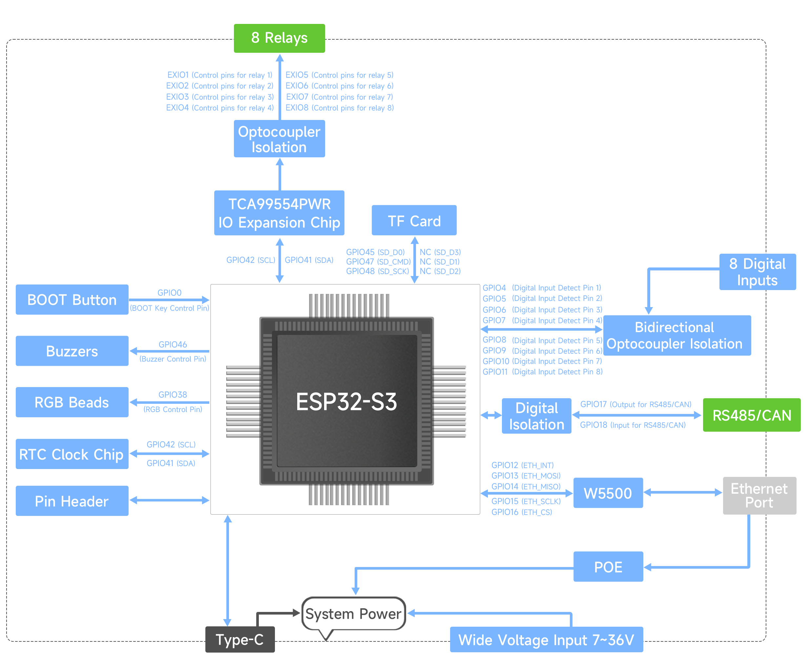

# Hardware Notes: Waveshare ESP32-S3-ETH-8DI-8RO-C

Source: [product page](https://www.waveshare.com/esp32-s3-eth-8di-8ro-c.htm),
[wiki](https://www.waveshare.com/wiki/ESP32-S3-ETH-8DI-8RO-C), and
Waveshare's own "Implementation Logic" block diagram (saved locally at
[images/Implementation_logic.jpg](../images/Implementation_logic.jpg)),
which gives the GPIO mapping used below. Still worth a final cross-check
against the schematic/demo code before writing drivers — see
[Open Questions](#open-questions).

## Variants

| Variant | Network | Notes |
|---|---|---|
| ESP32-S3-ETH-8DI-8RO-C | Standard 10/100 Ethernet | This is the one we have |
| ESP32-S3-POE-ETH-8DI-8RO-C | PoE Ethernet | Same board + PoE module |

Both use the same MCU, relay, DI and CAN circuitry — the only difference is
Ethernet power delivery. Everything in this repo targets the "-C" (CAN)
non-PoE variant unless stated otherwise.

There is also a non-"C" `ESP32-S3-ETH-8DI-8RO` sibling board that has
**RS485 instead of CAN** — not usable for ISOBUS. Make sure any purchase
link / BOM references the **-C** (CAN) suffix.

## Core specs

- **MCU:** ESP32-S3-WROOM-1U-N16R8 — Xtensa LX7 dual-core @ 240 MHz,
  16 MB flash, 8 MB PSRAM, Wi-Fi 2.4 GHz + BLE 5, external antenna (U.FL/SMA).
- **Power input:** 7–36 VDC screw terminal (matches 12 V and 24 V tractor
  electrical systems directly, no external converter needed). USB-C is 5 V,
  for flashing/debug only.
- **Relay outputs:** 8 channels, 1NO+1NC contacts, ≤10 A @ 250 VAC or 30 VDC,
  optocoupler-isolated from logic.
- **Digital inputs:** 8 channels, 5–36 V, supports passive (dry contact) and
  active (NPN/PNP, "wet") inputs, bi-directional optocoupler isolation.
- **CAN:** ESP32-S3 built-in TWAI controller → onboard isolated CAN
  transceiver, screw terminal, reserved 120 Ω termination resistor enabled
  via jumper (needed at bus ends per ISO 11783-2).
- **Ethernet:** W5500 (SPI, 10/100 Mbps) — not on the ISOBUS network; a
  separate IP network for config/OTA/logging if we use it at all.
- **Other on-board resources:** PCF85063A RTC (needs a rechargeable
  1220-size 3–3.3 V cell, not included by default on all batches — verify),
  buzzer, WS2812 RGB status LED (GPIO38 per Waveshare demo notes),
  TCA9554PWR I²C GPIO expander (I²C address `0x20`), microSD slot, BOOT/RESET
  buttons, 28-pin 2.54 mm expansion header.
- **Enclosure:** DIN-rail (35 mm) ABS case, 175 × 90 × 40 mm.

## Why this board fits an ISOBUS relay block

| ISOBUS Block feature | This board |
|---|---|
| CAN physical layer to talk ISO 11783 | Onboard isolated CAN transceiver ✅ |
| 8 relay outputs | 8 relays, 10 A rated ✅ |
| Sensor inputs for automation | 8 isolated digital inputs ✅ |
| 12 V/24 V tractor power | 7–36 V input ✅ |
| Industrial isolation | Opto + power isolation on DI/relay side ✅ |
| DIN-rail mountable | Yes ✅ |

Gaps vs. the commercial product that the firmware/BOM needs to account for:

- No AEF/ISOBUS conformance certification — this is a hobbyist device, not
  a certified ISOBUS implement. It should still be protocol-correct enough
  to interoperate with real terminals, but can't claim AEF certification.
  Include this in the README/legal notices.
- No open-frame relay diagnostics (current sense/contact welding detection)
  — the board has no per-channel feedback path, so relay-fault DM1 reporting
  is limited to "commanded vs. best-effort" unless we add external sensing.
- Connectors: ISOBUS Block ships proper Deutsch/AMP in-cab and implement
  connectors as accessories. This board only has screw terminals — a wiring
  harness/connector kit is a separate hardware task, not firmware.

## GPIO mapping

Confirmed from Waveshare's "Implementation Logic" diagram
():

| Function | ESP32-S3 pin(s) | Notes |
|---|---|---|
| Relay channels 1–8 | via I²C (`GPIO41`=SCL, `GPIO42`=SDA) | **Not direct GPIO.** Driven through the onboard **TCA9554PWR** I²C IO expander (addr `0x20`, `EXIO1`–`EXIO8`) → optocoupler isolation → relays. Relay driver must talk I²C, not `gpio_set_level`. |
| Digital inputs 1–8 | `GPIO4, 5, 6, 7, 8, 9, 10, 11` | Direct GPIO, one pin per input, through bidirectional optocoupler isolation. |
| CAN (TWAI) | TX=`GPIO17`, RX=`GPIO18` | Labeled "RS485/CAN" on the diagram — same two pins are used for the RS485 variant of this board; on our **-C** variant the populated transceiver is CAN. Goes through a digital isolation stage before the connector. |
| Ethernet (W5500, SPI) | `GPIO12`=INT, `GPIO13`=MOSI, `GPIO14`=MISO, `GPIO15`=SCLK, `GPIO16`=CS | |
| RTC (PCF85063A) | Same I²C bus as relay expander: `GPIO41`=SCL, `GPIO42`=SDA | Shares the bus with the TCA9554PWR — I²C transactions for relays and RTC must be serialized (mutex), not assumed independent. |
| microSD (TF card) | `GPIO45`=SD_D0, `GPIO47`=SD_CMD, `GPIO48`=SD_SCK | `SD_D1`/`SD_D2`/`SD_D3` are NC — 1-bit SD mode only. |
| WS2812 RGB LED | `GPIO38` | |
| Buzzer | `GPIO46` | |
| BOOT button | `GPIO0` | Standard ESP32 strapping pin, also used for entering download mode. |
| Expansion pin header | Not individually labeled on the diagram | General purpose, low priority for this project. |
| System power | Type-C (5 V, dev/debug only), screw-terminal 7–36 V DC, or PoE module (POE variant only) — all feed a common "System Power" rail | |

This has direct architecture impact: relay control is an **I²C-mediated**
operation (TCA9554PWR), not a plain GPIO toggle — see
[architecture.md](architecture.md) for how the I/O driver layer accounts
for this (I²C bus shared with the RTC, needs serialized access).

Still worth confirming against the schematic/demo firmware before final
implementation (exact pull-up requirements on the shared I²C bus, TWAI bus
mode/termination default, SPI clock speed for the W5500), but the pin
numbers themselves are no longer a planning placeholder.

**Correction (bench-confirmed 2026-09-10):** the diagram's I²C SDA/SCL
labeling for `GPIO41`/`GPIO42` is reversed from what actually works. An I²C
bus scan (`firmware/main/io/i2c_scan`) found zero devices with
`GPIO41`=SDA/`GPIO42`=SCL as the diagram implies, and both onboard devices
(`0x20` TCA9554PWR, `0x51` PCF85063A RTC) with `GPIO41`=SCL/`GPIO42`=SDA —
the table above already reflects the corrected assignment. Image-derived
pinouts are a strong lead, not a substitute for a bench check, exactly as
flagged below before this was confirmed.

## Datasheets & tools (for reference during development)

- [ESP32-S3 datasheet](https://files.waveshare.com/wiki/common/Esp32-s3_datasheet_en.pdf)
- [ESP32-S3 technical reference manual](https://files.waveshare.com/wiki/common/Esp32-s3_technical_reference_manual_en.pdf)
- [ESP32-S3-WROOM-1/1U datasheet](https://files.waveshare.com/wiki/common/Esp32-s3-wroom-1_wroom-1u_datasheet_en.pdf)
- Waveshare demo package (Arduino examples: WiFi AP/STA/MQTT/Bluetooth relay
  control, CAN passthrough print) — useful only for confirming pin mapping;
  we will not build on top of the Arduino demo application logic itself
  (see [architecture.md](architecture.md) for why).
- [USB-CAN-A tool](https://files.waveshare.com/wiki/common/USBCANV2.10.zip) —
  handy for sniffing/injecting ISOBUS traffic on the bench.

## Open questions

- [x] Confirm exact GPIO numbers for relay channels 1–8 and digital inputs 1–8 — see [GPIO mapping](#gpio-mapping).
- [x] Confirm whether relays/DIs are direct GPIO or via the TCA9554PWR I²C expander — relays are via the expander, DIs are direct GPIO.
- [x] Confirm TWAI (CAN TX/RX) GPIO pins used between the ESP32-S3 and the isolated transceiver — `GPIO17`/`GPIO18`.
- [x] Confirm I²C SDA/SCL pin assignment for `GPIO41`/`GPIO42` — diagram had them reversed; bench-confirmed as `GPIO41`=SCL, `GPIO42`=SDA via bus scan (both `0x20` and `0x51` ack).
- [ ] Confirm RTC battery is populated/required for our use case (probably not needed for MVP).
- [ ] Decide on physical ISOBUS connector/harness (screw terminal → Deutsch DT06/DT04 pigtail) — hardware task, not firmware, but affects the "bill of materials" doc later.
- [ ] Confirm I²C bus speed vs. relay-toggle latency under load (currently running the internal pull-ups at 100 kHz, which worked for bring-up, but not benchmarked).
- [ ] Double check against the schematic whether `GPIO17`/`GPIO18` need any variant-specific (CAN vs. RS485) transceiver-enable/mode pin beyond TX/RX.
- [x] Confirm correct DI wiring polarity: bench-observed that each DI
      channel's onboard status LED lights faintly at idle and gets
      *brighter* pulling toward DGND (0 V), unaffected pulling toward
      COM -- explained once the actual circuit was confirmed rather than
      assumed. The wiki itself blocks automated fetches (403), but
      Waveshare's official Arduino demo package
      (`ESP32-S3-POE-ETH-8DI-8RO-C-Demo.zip`, `WS_DIN.cpp`) is unambiguous:
      `pinMode(DIN_PINx, INPUT_PULLUP)` on all 8 channels, plus a
      `DIN_Inverse_Enable` flag that inverts the raw reading before using
      it. That means each channel's optocoupler pulls the *isolated-side*
      GPIO LOW when the input is actually asserted (field-side LED driven,
      i.e. pulled toward DGND) and leaves it floating otherwise -- active
      **low**, not active-high, and pull-**up** is the correct idle bias,
      not pull-down. Our earlier `GPIO_PULLDOWN_ENABLE` fix (for floating-
      input noise) picked the wrong direction for this circuit even though
      it did fix the floating-noise symptom (either direction defines
      *some* idle level); switched to `GPIO_PULLUP_ENABLE` with the raw
      reading inverted in `input_driver.cpp` to match the official
      firmware exactly. Bench-confirmed the polarity now makes sense
      against the LED behavior above. See
      [input_driver.cpp](../firmware/main/io/input_driver.cpp).
